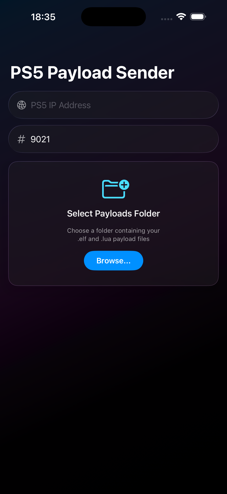

<p align="center">
  
</p>

<h1 align="center">PS5 Payload Sender</h1>

<p align="center">
  Send <code>.elf</code> and <code>.lua</code> payloads to your PS5 from your iPhone.
</p>

<p align="center">
  
  
  
</p>

## Screenshots

<p align="center">
  
  &nbsp;&nbsp;
  
  &nbsp;&nbsp;
  
</p>

## What It Does

Sends payload files to your PS5 over Wi-Fi using a raw TCP connection. Works with `.lua` (port 9026) and `.elf` (port 9021) files.

Load your payloads from **Dropbox**, **iCloud Drive**, **Google Drive**, or any folder visible in the iOS Files app.

## Installation

### Option 1 — TrollStore (no PC, no Apple account)

Download the latest `.ipa` from the [Releases](https://github.com/jujuforce/PS5PayloadSender-iOS/releases) page and install it with [TrollStore](https://github.com/opa334/TrollStore) or any other IPA installer (Sideloadly, AltStore, etc.).

### Option 2 — Build yourself

```bash
git clone https://github.com/jujuforce/PS5PayloadSender-iOS.git
cd PS5PayloadSender
cp Local.xcconfig.template Local.xcconfig
```

Edit `Local.xcconfig`:
```
DEVELOPMENT_TEAM = YOUR_TEAM_ID
PRODUCT_BUNDLE_IDENTIFIER = com.yourname.PS5PayloadSender
```

Open `PS5PayloadSender.xcodeproj` in Xcode, build & run on your device.

## Usage

1. Select a folder with your payload files (first launch only)
2. Enter your PS5's IP address
3. Tap a payload, then **Send**

The port updates automatically based on the selected payload type (`.lua` → `9026`, `.elf` → `9021`). You can override it manually if needed.

## License

[MIT](LICENSE)
